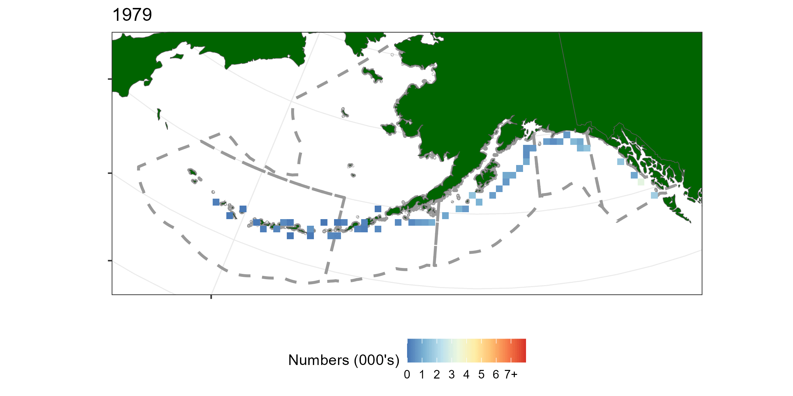

# Survey data {#surveydata}

This chapter describes how age,length, survey and catch data were used to derive assessment inputs for a myriad of spatially structured assessments. The chapter aims to standardize methods so that we can easily re-work the data to be fit in a 1,2 or \(n_r\) area assessment model.


```{r LLRegions, out.width = '100%', fig.height= 5, fig.cap="The finest spatial resolution that we are considering for Sablefish assessment", echo = F, eval = T}
include_graphics(file.path("Figures", "Longline_areas.png"))
```


## Survey Abundance data {#surveyData}

I am thinking, when it comes to the real data application that we apply a geostatistical model-based estimator. The survey is a systematic/fixed design (do they visit the same locations each year? obviously ignoring the AI BS switching), but use a stratified survey estimator for the population total and variance. This is often done because there are no known design based estimators for systematic surveys that have a single primary sampling unit i.e., the only random event would be for the first station then the rest are systematically placed based on the first sampling unit. I am wondering if a stratified random variance estimator will over state or under state the precision? 


A useful reference for changes in survey operators for the Alaskan sablefish is @kimura1997standardizing. "The Japanese long-line gear used in the joint surveys and the NMFS long-line gear are similar in many respects...Differences between Japanese sampling gear and NMFS sampling gear were mostly due to hook and gangion construction". When analysing the survey CPUE data it would be ideal to have a single time-series. So a desirable population total estimator would account for different catchabilities by country or vessel.


```{r surveycatchgif, fig.cap="A time-series of sablefish catch from the long line survey pooled over 50km by 50km grided cells", eval = T, echo = F}

```

## Age-frequency {#AFs}
A big challenge of any spatial stock assessment is deriving spatially disaggregated age-frequency observations from low age sample sizes. For both the long-line survey and fishery we have both age and length data sets. This means there are multiple estimators available, including direct ageing, length frequency analysis [@andrade2004estimation] (Length frequency analysis decomposes length frequency histograms into age classes) and age-length key [@ailloud2019general;@hoenig2002generalizing]. The forward age-length key method at face value looks to be the most attractive, as it reduces data sparsity when compared to direct ageing estimators.


A note on sablefish otolith sampling from the survey. "Otolith collections were length-stratified from 1979-94 and random thereafter" pg 9 of @sigler2001alaska.

```{r agesamples, out.width = '100%', fig.height= 5, fig.cap="Number of aged fish by sex, region and year", echo = F, eval = T}
include_graphics(file.path("Figures", "age_samples_by_year_region_sex.png"))
```


### Length-frequency {-}


```{r lengthsamples, out.width = '100%', fig.height= 5, fig.cap="Number of fish measured for length by sex, region and year", echo = F, eval = T}
include_graphics(file.path("Figures", "length_samples_by_year_region_sex.png"))
```

## Observer data {#ObserverData}


## Growth data {#Growth}


```{r agelengthbysex, echo=FALSE,out.width="61%", fig.height=6,fig.cap="Age-length by sex",fig.show='hold',fig.align='center'}
knitr::include_graphics(c(file.path("Figures","raw_growth_by_sex.png")))
``` 


```{r malegrowth, echo=FALSE,out.width="49%", fig.height=5,fig.cap="Male age-length by region (left panel) and decade (right panel)",fig.show='hold',fig.align='center'}
knitr::include_graphics(c(file.path("Figures","raw_male_growth_by_region.png"),file.path("Figures","raw_male_growth_by_decade.png")))
``` 


```{r femalegrowth, echo=FALSE,out.width="49%", fig.height=5,fig.cap="Female age-length by region (left panel) and decade (right panel)",fig.show='hold',fig.align='center'}
knitr::include_graphics(c(file.path("Figures","raw_female_growth_by_region.png"),file.path("Figures","raw_female_growth_by_decade.png")))
``` 

## Catch data {#CatchData}


## Appendix {-}

Sampling notation


+----------------------------+-----------------------------------------------------------------------------+
| Symbol                     | Description                            
+============================+=============================================================================+
| \(h\)                      | haul index
+----------------------------+-----------------------------------------------------------------------------+
| \(i\)                      | an individual fish index
+----------------------------+-----------------------------------------------------------------------------+
| \(a_i\)                    | age of individual \(i\)
+----------------------------+-----------------------------------------------------------------------------+
| \(l_i\)                    | length of individual \(i\) 
+----------------------------+-----------------------------------------------------------------------------+
| \(C^h\)                    | Catch for haul \(h\) can be numbers or biomass
+----------------------------+-----------------------------------------------------------------------------+
| \(n^h_l\)                  | number of fish measured for length from haul \(h\) 
+----------------------------+-----------------------------------------------------------------------------+
| \(n^h_a\)                  | number age samples in haul \(h\). Assumed to be a subsample of \(n^h_l\)
+----------------------------+-----------------------------------------------------------------------------+


```{r femaleCDFagesamples, out.width = '100%', fig.height= 10, fig.cap="CDF of age frequencies for females", echo = F, eval = T}
include_graphics(file.path("Figures", "raw_ecdf_AFs_by_year_region_female.png"))
```

```{r maleCDFagesamples, out.width = '100%', fig.height= 10, fig.cap="CDF of age frequencies for males", echo = F, eval = T}
include_graphics(file.path("Figures", "raw_ecdf_AFs_by_year_region_male.png"))
```


```{r femaleCDFlengthsamples, out.width = '100%', fig.height= 10, fig.cap="CDF of length frequencies for females", echo = F, eval = T}
include_graphics(file.path("Figures", "raw_ecdf_LFs_by_year_region_female.png"))
```

```{r maleCDFlengthsamples, out.width = '100%', fig.height= 10, fig.cap="CDF of length frequencies for males", echo = F, eval = T}
include_graphics(file.path("Figures", "raw_ecdf_LFs_by_year_region_male.png"))
```
