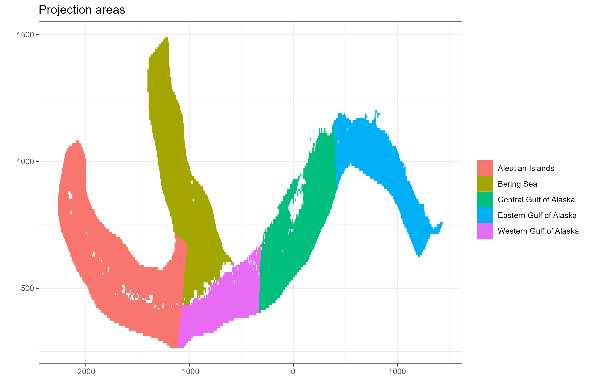

# Survey data {#surveydata}

This chapter explores and describes survey age, length and catch rate data to inform the following spatial model decisions

- Is there spatial differences in age or length composition?
- Is there spatial differences in relative abundance?
- Is there spatial differences growth?


## Survey design {-}

The longline survey in the Gulf of Alaska and Bering Sea began in 1978-79 and is fixed station systematic design [@sasaki1985studies]. "Survey stations are distributed as uniformely as possible in each geographic area. One station per day is fished, and normally 160 hachis/skates are fished at each station. The longline is set at right angles to the isobars in a manner to cover the depth range of 101- 1,000 m. However, the distance between 101 and 1,000 m varied at each survey station. Thus, this complete depth range could not be covered at stations where this distance exceeded the 16 km length of the longline gear. The longline was usually set from shallow to deep waters and was retrieved in the same direction. Hauling the longline started 2 hours after the set was completed." pg 68 @sasaki1985studies


Each hachi is assigned to a depth stratum which is treated as an independent observation by stratified estimators to generate population estimates and associated variance (**Is this right?** seems inappropriate given all these hachi are essentially a cluster from a single fishing event)


## Abundance (catch rate) data {-}
A geostatistical model-based estimator was used to estimate spatial estimates of abundance. `sdmTMB` [@sdmTMB]  was the package used for this exercise. Geostatistical models require spatial locations to be known for all observations. A limitation of using hachi level data is latitude and longitude is only known for the whole longline event (e.g., all hachi on the same line have the same spatial coordinates). For each longline event we summed over all hachi. Survey abundnace pooled over 50km x 50km grid cells is shown in Figure \@ref(fig:surveycatchgif).


```{r surveycatchgif, fig.cap="A time-series of sablefish catch from the long line survey pooled over 50km by 50km grided cells", eval = T, echo = F}
knitr::include_graphics("Figures/catch.gif")
```


<!-- One of the aims is to a geostatistical model-based estimator [@sdmTMB] with the current estimator. The survey is a systematic/fixed design, but the current estimator for the population total and variance is based on a stratified random survey design. This is often done because there is no design based estimator for systematic surveys that have a single primary sampling unit i.e., the only random event would be for the first station then the rest are systematically placed based on the first sampling unit. I wonder if a stratified random variance estimator will under state the variance (see @fewster2011variance for more detail on this issue).  -->


<!-- A consideration when using the survey data within a geostatistical model-based estimator is what to define an observation as. The current estimator treats each skate/hachi as an "observation" (need to ask about this). Due to the fishing of gear being perpendicular to land a single fishing event can cover many depth strata. Each skate/hachi is attached to a depth strata where it is used in the current estimator (does this inflate the sample size? should skate within a fishing event be treated as a cluster?). Although it would be interesting to use the skate/hachi level data, only the start and end latitude and longitudes are recorded. This means we would have to interpolate a coordinate for each skate or pool data over each fishing event for use in the geostatistical model? -->


A range of covariates, spatio-temporal and likelihood assumptions were considered in the geostatistical analysis. Two covariates that were forced in the model whether they were statistically significant or not was Year and country. There has been documented difference between Japanese and NMFS sampling relating to hook and ganion construction [@kimura1997standardizing]. 


Given the unusual shape of the coast for the region, an boundary was created to avoid spatial regions in the Bearing sea sharing information with CGOA and EGOA. The mesh assumed in models that has spatial random effects but **not** spatio-temporal random effects is shown in Figure \@ref(fig:meshCPUE).

```{r meshCPUE, fig.cap="Mesh for spatial random effects, red dots indicate station location", eval = T, echo = F, fig.width=5, fig.height= 5}
knitr::include_graphics("Figures/mesh.png")
```

The first model was configured using code chunk \@ref(fig:firstModel).
```{r firstModel, echo = T, eval = F}
fit_spatial_tweedie <- sdmTMB(
  catch ~ 0  + as.factor(Year) + Country,
  family = tweedie(link = "log"),
  spatial = "on",
  time = "Year",
  spatiotemporal = "off",
)
```

This model structure was repeated assuming the Gamma and Lognormal distribtion because there were only 5 records of 4000 that did not catch sablefish strictly positive distributions were only considered. Residuals shown in Figure \@ref(fig:meshCPUE)


```{r spatialResid, fig.cap="Boxplot comparing overall residuals between distributions", eval = T, echo = F, fig.width=5, fig.height= 5}
knitr::include_graphics("Figures/spatial_residuals.png")
```


+----------------------------+-----------------------------------------------------------------------------+
| Symbol                     | Description                            
+============================+=============================================================================+
| \(\mathcal{M}_1\)          | `y ~ year + country + omega`
+----------------------------+-----------------------------------------------------------------------------+
| \(\mathcal{M}_2\)          | `y ~ year + country + FMP_region + omega`
+----------------------------+-----------------------------------------------------------------------------+
| \(\mathcal{M}_3\)          | `y ~ year + country + epsilon`
+----------------------------+-----------------------------------------------------------------------------+

where `omega` is time-invariant Gaussian Field (GF) and `epsilon` is time-varying Gaussian Field


```{r spatialprediction, fig.cap="Spatial predition M1 with the tweedie distribution.", eval = T, echo = F, fig.width=5, fig.height= 5}
knitr::include_graphics("Figures/spatial_tweedie_predict.png")
```


```{r indexComparison, fig.cap="Comparison of indicies for the Tweedie distribution and the three model structures.", eval = T, echo = F, fig.width=5, fig.height= 5}
knitr::include_graphics("Figures/indicies.png")
```


```{r surveyProjection, fig.cap="Projection regions", eval = T, echo = F, fig.width=5, fig.height= 5}

```


## Age data {-}
A big challenge of any spatial stock assessment is deriving spatially disaggregated age-frequency observations from low age sample sizes. For both the long-line survey and fixed gear fishery we have both age and length observations. This means there are multiple estimators available, including; direct ageing and age-length key [@ailloud2019general;@hoenig2002generalizing]. The forward age-length key method at face value looks to be the most attractive, as it reduces data sparsity when compared to direct ageing estimators. However, we will generate AF's for both methods and see if they effect any model outputs.


A note on sablefish otolith sampling from the survey. "Otolith collections were length-stratified from 1979-94 and random thereafter" pg 9 of @sigler2001alaska.

```{r agesamples, out.width = '100%', fig.height= 5, fig.cap="Number of aged fish by sex, region and year", echo = F, eval = T}
include_graphics(file.path("Figures", "age_samples_by_year_region_sex.png"))
```


## Length frequencies {-}
Often, each haul is subsampled for LF measurements. For each haul we calculate the sampling fraction of samples for LF vs the entire haul catch
\[
\pi_h = \frac{n_h}{N_h}
\]
where, \(n_h\) is the number of fish measured for LF and \(N_h\) are the total number of fish caught in haul \(h\). Each length measurement is then scaled by this sampling fraction to derive the length frequency for the entire haul,

\[
N^h_l = \frac{\pi_h}{n^h_l}
\]
where, \(n^h_l\) is the number of fish in length bin \(l\) for haul \(h\), and \(N^h_l\) is the scaled number of fish.

To generate region wide LF's from the survey data, we used the mean estimator
\[
N^r_l = \frac{1}{\sum\limits_{h \in r}1} \sum\limits_{h \in r} N^h_l
\]
where, \(h \in r\) denotes only hauls within region \(r\) and \(\sum\limits_{h \in r}1\) indicates the number of hauls in that region.


```{r lengthsamples, out.width = '100%', fig.height= 5, fig.cap="Number of fish measured for length by sex, region and year", echo = F, eval = T}
include_graphics(file.path("Figures", "length_samples_by_year_region_sex.png"))
```

## Age frequencies {-}

Two estimators were explored for deriving spatially disaggregated age-frequencies from survey data. These were direct ageing estimators and age-length key estimators.

### Direct ageing estimators

The direct ageing estimator we applied assumed age-samples within a region and year are the result of simple random sampling, with the estimator.

\[
P_{a,r,y} = \frac{n_{a,r, y}}{\sum\limits_a n_{a,r, y}}
\]
where, \(P_{a,r,y}\) is the proportion in age \(a\) and \(n_{a,r, y}\) are the number of fish aged in age \(a\) region  \(r\) and year \(y\).

To aggregate age frequencies across areas we use an abundance weighted approach, where the abundance estimated from the survey in region \(r\) and year \(y\) denoted by \(I_{r,y}\) is used,

\[
\tilde{P}_{a,r,y} = P_{a,r,y} \frac{I_{r,y}}{\sum\limits_r I_{r,y}}  \  .
\]
If we are going to aggregate proportions at age over multiple regions we would use \(\tilde{P}_{a,r,y}\) such as,

\[
{P}_{a,R,y} = \sum\limits_{r \in R} \tilde{P}_{a,r,y}
\]
where, \(R\) indicates the set of areas that we are aggregating and this is normalized so that it sums to one, which leads to area aggregated estimates

\[
{P}_{a,R,y} = \frac{{P}_{a,R,y}}{\sum\limits_a{P}_{a,R,y}}  \ .
\]


For length bins that don't have age-length data a linear interpolation is done between neighboring length columns of the age-length key for all ages.

### Age length key estimators
The Age length key (ALK) estimator uses paired age-lengths to calculate an age-length key which is used to derive age-frequencies by multiplying the ALK by scaled length frequencies.

Constructing an age-length key requires paired age and length measurements which calculate the probability of age given a length bin

\[
\hat{p}(a|l) = \frac{n_{a,l}}{n_{+,l}}
\]
where, \(n_{+,l}\) is the number of ages with corresponding lenghts that fall within length bin \(l\).

The probabilities of age given length using the forward ALK method are then simply multiplied by the marginal probabilities by the scaled length frequencies

\[
P_{a,r} = \hat{p}(a|l) N^r_l
\]

where, \(N^r_l\) are regional specific scaled length frequencies (described in the prior section). The ALK can also be regional specific where only paired age-lengths are used from that region. This is not considered in this work because of the lack of samples when building ALKs at this resolution.


### Observation error estimates

Bootstrapping is used to estimate standard errors for \(P_{a,R,y}\). Data used to calculate age-length keys are re sampled with replacement to calculate a SE and CV. This produces a CV for each age, region and year denoted by \(CV_{a,r, y}\). Proportions at age are assumed to be distributed according to the multinomial distribution. To translate the observation error expressed as a CV to an initial effective sample denoted by \(N^{eff}_y\) we apply a non-linear least squares solver to estimate \(N^{eff}_y\) by minimsing the following expression

\[
\log CV_{a,r, y} = \log \sqrt{\frac{P_{a,R,y}\widehat{N}^{eff}_y \left(1 -  P_{a,R,y}\right)}{P_{a,R,y}\widehat{N}^{eff}_y}}
\]


## Age-length data {-}


```{r agelengthbysex, echo=FALSE,out.width="61%", fig.height=6,fig.cap="Age-length by sex",fig.show='hold',fig.align='center'}
knitr::include_graphics(c(file.path("Figures","raw_growth_by_sex.png")))
``` 


```{r malegrowth, echo=FALSE,out.width="49%", fig.height=5,fig.cap="Male age-length by region (left panel) and decade (right panel)",fig.show='hold',fig.align='center'}
knitr::include_graphics(c(file.path("Figures","raw_male_growth_by_region.png"),file.path("Figures","raw_male_growth_by_decade.png")))
``` 


```{r femalegrowth, echo=FALSE,out.width="49%", fig.height=5,fig.cap="Female age-length by region (left panel) and decade (right panel)",fig.show='hold',fig.align='center'}
knitr::include_graphics(c(file.path("Figures","raw_female_growth_by_region.png"),file.path("Figures","raw_female_growth_by_decade.png")))
``` 


## Appendix {-}

Sampling notation


<!-- +----------------------------+-----------------------------------------------------------------------------+ -->
<!-- | Symbol                     | Description                             -->
<!-- +============================+=============================================================================+ -->
<!-- | \(h\)                      | haul index -->
<!-- +----------------------------+-----------------------------------------------------------------------------+ -->
<!-- | \(i\)                      | an individual fish index -->
<!-- +----------------------------+-----------------------------------------------------------------------------+ -->
<!-- | \(a_i\)                    | age of individual \(i\) -->
<!-- +----------------------------+-----------------------------------------------------------------------------+ -->
<!-- | \(l_i\)                    | length of individual \(i\)  -->
<!-- +----------------------------+-----------------------------------------------------------------------------+ -->
<!-- | \(C^h\)                    | Catch for haul \(h\) can be numbers or biomass -->
<!-- +----------------------------+-----------------------------------------------------------------------------+ -->
<!-- | \(n^h_l\)                  | number of fish measured for length from haul \(h\)  -->
<!-- +----------------------------+-----------------------------------------------------------------------------+ -->
<!-- | \(n^h_a\)                  | number age samples in haul \(h\). Assumed to be a subsample of \(n^h_l\) -->
<!-- +----------------------------+-----------------------------------------------------------------------------+ -->


```{r femaleCDFagesamples, out.width = '100%', fig.height= 10, fig.cap="CDF of age frequencies for females", echo = F, eval = T}
include_graphics(file.path("Figures", "raw_ecdf_AFs_by_year_region_female.png"))
```

```{r maleCDFagesamples, out.width = '100%', fig.height= 10, fig.cap="CDF of age frequencies for males", echo = F, eval = T}
include_graphics(file.path("Figures", "raw_ecdf_AFs_by_year_region_male.png"))
```


```{r femaleCDFlengthsamples, out.width = '100%', fig.height= 10, fig.cap="CDF of length frequencies for females", echo = F, eval = T}
include_graphics(file.path("Figures", "raw_ecdf_LFs_by_year_region_female.png"))
```

```{r maleCDFlengthsamples, out.width = '100%', fig.height= 10, fig.cap="CDF of length frequencies for males", echo = F, eval = T}
include_graphics(file.path("Figures", "raw_ecdf_LFs_by_year_region_male.png"))
```
